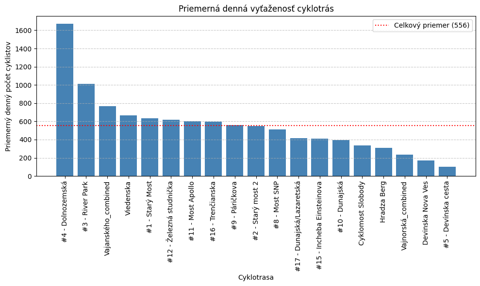
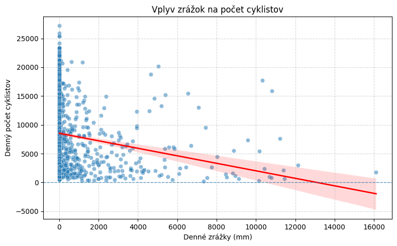
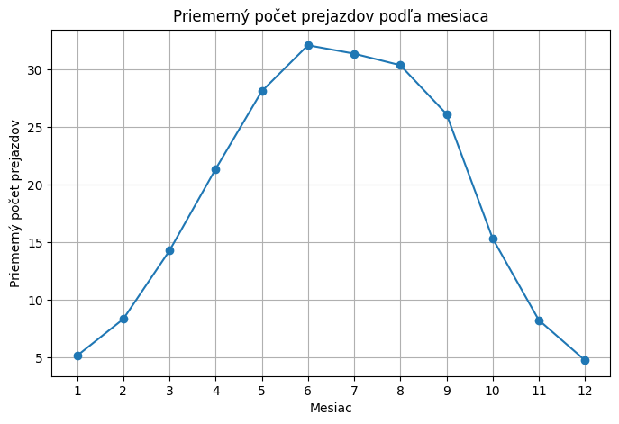
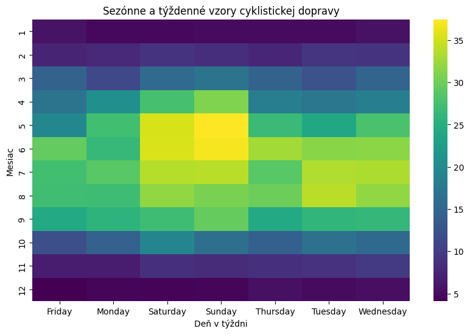
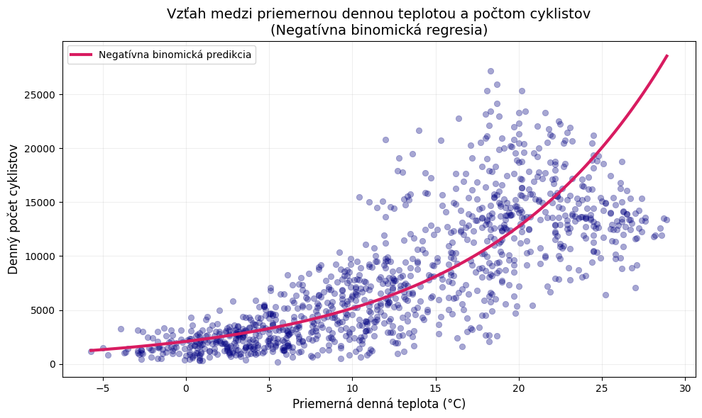
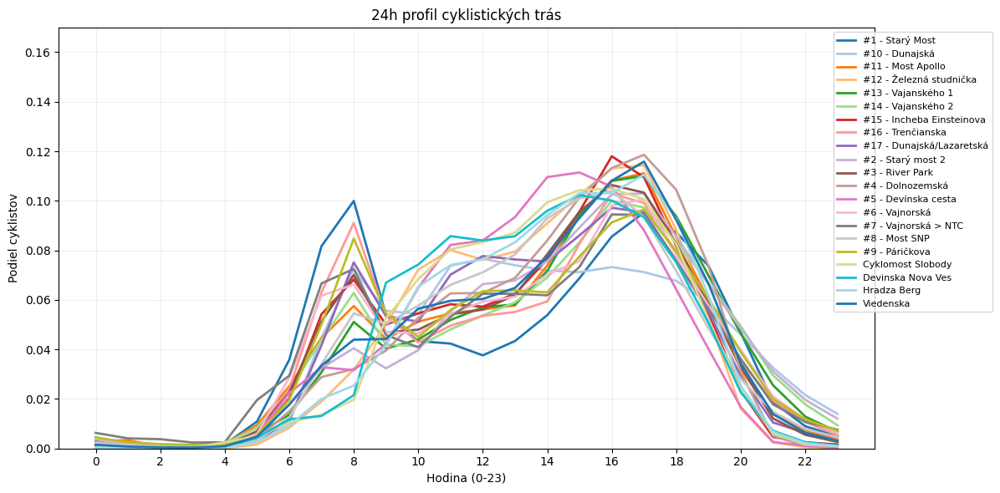
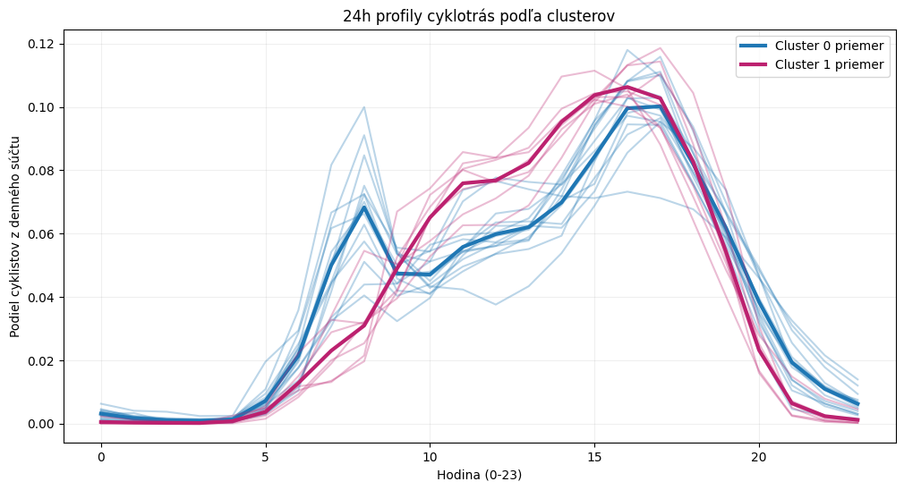

# Bratislavské cyklotrasy

Analýza správania cyklystov v Bratislave vrámci projektu pre 1-DAV-302/20 - Princípy dátovej vedy.

## 1. Výskumné otázky a cieľ projektu

Cieľom projektu je analyzovať správanie cyklistov v Bratislave na základe dát z cyklosčítačov a meteorologických meraní, identifikovať časové vzory využívania cyklotrás a preskúmať vplyv vybraných poveternostných podmienok na intenzitu cyklistickej dopravy.

### Výskumné otázky a hypotézy

**1. Líši sa denná vyťaženosť jednotlivých cyklotrás v Bratislave?**  
- H₀: Medzi jednotlivými cyklotrasami neexistujú významné rozdiely v priemernej dennej vyťaženosti.  
- H₁: Medzi jednotlivými cyklotrasami existujú významné rozdiely v priemernej dennej vyťaženosti.

**2. Existujú rozdiely v správaní cyklistov medzi pracovnými dňami a víkendmi?**  
- H₀: Priemerný počet cyklistov počas pracovných dní a víkendov je rovnaký.  
- H₁: Priemerný počet cyklistov sa medzi pracovnými dňami a víkendmi líši.

**3. Vykazuje cyklistická doprava v Bratislave sezónne správanie?**  
- H₀: Vyťaženosť cyklotrás je počas roka rovnomerná a bez výrazných sezónnych rozdielov.  
- H₁: Vyťaženosť cyklotrás sa medzi jednotlivými ročnými obdobiami významne líši.

**4. Ovplyvňujú zrážky počet cyklistov v Bratislave?**  
- H₀: Množstvo denných zrážok nemá vplyv na počet cyklistov.  
- H₁: Zvýšené množstvo denných zrážok vedie k poklesu počtu cyklistov.

**5. Existuje vzťah medzi priemernou dennou teplotou a počtom cyklistov?**  
- H₀: Medzi priemernou dennou teplotou a počtom cyklistov neexistuje vzťah.  
- H₁: Medzi priemernou dennou teplotou a počtom cyklistov existuje vzťah.

**6. Je možné na základe časových vzorov využiť dáta na rozlíšenie rôznych typov cyklotrás?**  
- H₀: Všetky cyklotrasy majú podobný časový profil využitia.  
- H₁: Cyklotrasy je možné rozdeliť do skupín s odlišným časovým profilom využitia.

**7. Existujú významné rozdiely v správaní cyklistov pred otvorením a po otvorení cyklocesty na Vajanského nábreží, ktoré sa uskutočnilo 6.9.2023?**
- H₀: Denné počty cyklistov na vybraných trasách v období september-október v rokoch 2022 a 2023 sa nelíšia.
- H₁: Denné počty cyklistov na vybraných trasách v období september-október v rokoch 2022 a 2023 sa líšia.

## 2. Použité technológie

### Programovacie jazyky a knižnice

#### Jazyky

- **Python**

#### Knižnice

1. Získanie a spracovanie dát:
   - **requests**, **pandas**
2. Analýza dát:
   - **sklearn**, **scipy.stats**
3. Vizualizácia dát:
   - **matplotlib**, **seaborn**, 

## 3. Získanie a spracovanie dát

### Dátové zdroje

#### 1. Dátový portál Hlavného mesta SR Bratislavy

- Dáta získané cez voľne dostupné API – kód na získanie dát sa nachádza v súbore **`cyklotrasy_data.ipynb`**
- Link k API dokumentácii: [data.Bratislava – API dokumentácia](https://data.bratislava.sk/pages/api-rozhranie)
- Link k online datasetu: [Cyklotrasy v BA – Dataset](https://data.bratislava.sk/datasets/097b7c8bc4b94560a7e34c9e64139a5e_0/explore)
- Autor: Hlavné mesto Slovenskej republiky Bratislava – Oddelenie dát, Sekcia digitalizácie
- Časové rozmedzie získaných údajov: **2014-07-18T07:00:00+00:00** – dva dni pred natiahnutím dát pomocou kódu, **23:00**
- Obsah dát:
  - **`nazov`** – názov cyklotrasy
  - **`zemepisna_sirka`** – súradnicový údaj o polohe snímača
  - **`zemepisna_dlzka`** – súradnicový údaj o polohe snímača
  - **`smer_do`** – smer, do ktorého snímač zaznamenáva cyklistov
  - **`smer_z`** – smer, z ktorého snímač zaznamenáva cyklistov
  - **`datum_a_cas`** – časový údaj záznamu
  - **`pocet_do`** – počet cyklistov zaznamenaných v smere **SMER_DO**
  - **`pocet_z`** – počet cyklistov zaznamenaných v smere **SMER_Z**

#### 2. Meteostat

- Dáta získané pomocou exportu z webstránky Meteostatu
- Link: [Počasie v BA](https://meteostat.net/en/place/sk/bratislava?s=11816&t=2023-01-01/2025-12-20)
- Autor: **Meteostat**
- Časové rozmedzie získaných údajov: **2023-01-01 – 2025-12-20**
- Obsah dát:
  - **`date`** – dátum, na ktorý sa predpoveď viaže
  - **`tavg`** – priemerná teplota vzduchu v stupňoch Celzia
  - **`tmin`** – minimálna teplota v stupňoch Celzia
  - **`tmax`** – maximálna teplota v stupňoch Celzia
  - **`prcp`** – celkové zrážky v milimetroch
  - **`snow`** – hĺbka snehu v milimetroch
  - **`wdir`** – smer vetra v stupňoch
  - **`wspd`** – priemerná rýchlosť vetra v kilometroch za hodinu
  - **`wpgt`** – najsilnejšie nárazy vetra v kilometroch za hodinu
  - **`pres`** – tlak vzduchu na hladine mora v hektopascaloch
  - **`tsun`** – celkové trvanie slnečného svitu v minútach

### Proces zberu dát

#### 1. Predpoveď počasia v BA

- Dáta sa exportujú zo stránky Meteostatu priamo do CSV súboru, ktorý bol premenovaný na **`pocasie_data_raw.csv`**
- Súbor obsahuje **1085 záznamov**
- Každý záznam reprezentuje jeden deň
- Dáta poskytujú informácie o počasí a poveternostných podmienkach v Bratislave od začiatku roku 2023 do **20.12.2025**

#### 2. Cyklotrasy v BA

Súbor **`cyklotrasy_data.ipynb`** extrahuje z data.Bratislava API endpointu dáta do súboru **`cyklotrasy_data_bratislava.csv`**.

**Technická implementácia:**
- **Request:**
  - používa sa HTTP GET s nastaveným parametrom **`resultRecordCount=1000`** – veľkosť batchu (maximum dovolené cez daný endpoint)
- **Stránkovanie (paginácia):**
  - v cykle sa nastavuje **`resultOffset`** na základe spracovaného počtu dát
  - z každej odpovede sa čítajú **`features`** a pridávajú do zoznamu **`all_records`**
  - cyklus sa ukončí, keď počet načítaných záznamov v poslednom batchi je menší než **`resultRecordCount`**
- **Transformácia:**
  - zoznam **`all_records`** sa transformuje na tabuľku pomocou **`pandas.json_normalize`**
  - výsledkom je DataFrame so stĺpcami z **`features`** (t. j. **`attributes.*`**)
- **Export:**
  - DataFrame sa uloží do CSV súboru **`Data/cyklotrasy_data_bratislava_raw.csv`**

### Čistenie dát

Cieľom čistenia a predspracovania dát bolo zjednotiť časový rozsah oboch datasetov a pripraviť jednotný dataset vhodný na ďalšiu analýzu správania cyklistov v Bratislave.

#### Kvalita dát

Prvým krokom bolo zmenšenie cyklo datasetu na časové rozhranie datasetu s počasím. Dáta z cyklosčítačov obsahovali časový údaj vo formáte UTC na hodinovej báze. Meteorologické dáta obsahovali denné záznamy s dátumom bez časovej zložky. Do dát o cyklosčítačoch bol teda pridaný stĺpec **`datetime`**, ktorý je nastavený na bratislavskú časovú zónu a bude sa napájať na dáta o počasí v správny deň. Po vyfiltrovaní údajov s nechcenými dátumami sa už mohla kontrolovať samotná kvalita dát.

Ako prvé sme sa pozreli na samotné názvy cyklotrias a ich smery, počas čoho sme zistili, že niektoré stĺpce obsahujú navyše charakter '\n'. Všetky textové stĺpce boli kvôli tomu zo strán očistené pomocou funkcie `strip()`.

Pri kontrole kvality cyklo dát sa ukázalo, že pre každý snímač chýbajú časové záznamy. Tieto medzery mali rôzne dĺžky, niektoré len jednu hodinu, niektoré takmer celý deň. Tento problém bol vyriešený neskôr v časri 'Predspracovanie'. Zvyšné dáta boli plne vyplnené a neobsahovali žiadne 'podozrivé' hodnoty, ktoré by sa mohli rovnať prázdnej alebo nulovej hodnote. Odchýlky v rámci jednotlivých stĺpcov boli adekvátne ich obsahu.

Pri kontrole dát o počasí sa ukázalo, že dáta neobsahujú žiadne údaje o hĺbke snehu ani o smere vetra. Stĺpcu **`tsun`** chýbala približne tretina záznamov a stĺpcu **`prcp`** jeden záznam. Štandardná odchýlka nenaznačovala prítomnosť žiadnych vyplnených 'chýbajúcich' hodnôt na štýl `-1`.

Celkovo boli oba zdroje dát vyhodnotené ako použiteľné a nedostatky boli adresované počas predspracovania.

#### Predspracovanie

V cyklo dátach boli podstatné stĺpce premenované na lepšie čitateľné a použiteľné názvy. Následne boli odstránené stĺpce **`attributes.ObjectId`** a **`attributes.DATUM_A_CAS`**, keďže jeden nebol potrebný pre ďalšie kroky a druhý bol nahradený stĺpcom **`datetime`**.

Problém chýbajúcich časových úsekov bol vyriešený tak, že sa pre každý snímač doplnili všetky hodinové záznamy od jeho prvého sčítania po posledné. Do týchto záznamov sa zapísali hodnoty pre statické stĺpce (napr. názov, smery a počasie). Ak bol chýbajúci úsek dlhý iba 1-2 hodiny, tak boli počty cyklistov doplnené pomocou interpolácie - vypočítajú sa na základe okolitých hodnôt. Takto vypočítané hodnoty dostali hodnotu `True` v stĺpci **`was_imputed`**. Ak bola medzera väčšia, tak zostali počty prázdne. Týmto sme zabezpečili kontinuitu dát pre vizualizáciu, ale neprehnali sme to s 'hádaním' chýbajúcich dát.

Ďalej boli vytvorené stĺpce, ktoré by mohli byť užitočné pre zodpovedanie výskumných otázok:
- **`pocet_total`** – súčet stĺpcov **`pocet_do`** a **`pocet_z`**
- **`date`** – čisto dátumová časť zo stĺpca **`datetime`**
- **`weekday`** – číselné hodnoty zodpovedajúce dňu v týždni (0 – pondelok, …, 6 – nedeľa)
- **`is_weekend`** – 1, ak je daný deň sobota alebo nedeľa, inak 0
- **`month`** – číselná hodnota mesiaca
- **`year`** – rok
- **`season`** – ročné obdobie

V dátach o počasí boli odstránené prázdne stĺpce **`snow`** a **`wdir`**. Pre chýbajúcu hodnotu v stĺpci **`prcp`** bolo rozhodnuté, že keďže sa jedná iba o jeden záznam, bude nahradená hodnotou 0.

Cyklistické a meteorologické dáta boli spojené na základe dátumu pomocou ľavého spojenia (left join), čím sa zachovali všetky cyklistické záznamy a k nim boli priradené príslušné meteorologické údaje. Po spojení sa overilo vyplnenie všetkých údajov, kde sa potvrdilo, že chýbajú iba údaje v stĺpcoch, kde to bolo vopred akceptované a očakávané.

#### Skladovanie dát

Výsledný predspracovaný dataset bol uložený do súboru **`final_data.csv`**, ktorý slúži ako vstup pre ďalšie časti projektu. Pôvodné surové dáta zostali zachované v samostatných súboroch.

## 4. Analýza a výsledky

### Analýza dennej vyťaženosti

Relevantný kód k analýze sa nachádza v súboroch `denne_cyklo.ipynb` a `hypothesis1.ipynb`. Pred samotným testovaním boli dáta pre jednotlivé cyklotrasy upravené na spoločné časové obdobie, odstránili sa neúplné záznamy a v niektorých prípadoch boli trasy zlúčené, detaily sú  v súbore denne_cyklo.ipynb.

Otázka: Líši sa denná vyťaženosť jednotlivých cyklotrás v Bratislave?

Hypotézy:

H₀: Medzi jednotlivými cyklotrasami neexistujú významné rozdiely v priemernej dennej vyťaženosti. (Očakávaný počet cyklistov za deň je rovnaký pre všetky cyklotrasy, parameter trasa nemá významný vplyv na strednú hodnotu.)

H₁: Medzi jednotlivými cyklotrasami existujú významné rozdiely v priemernej dennej vyťaženosti. (Očakávaný počet cyklistov za deň sa líši medzi aspoň dvoma cyklotrasami.)

#### Voľba štatistického modelu pre analýzu dennej vyťaženosti cyklotrás

Predmetom analýzy sú denné počty cyklistov (`daily_total`) na jednotlivých cyklotrasách. Ide o nezáporné celočíselné údaje, ktoré reprezentujú zaznamenaný počet prejazdov bicyklov za deň. Tento typ dát nie je vhodný pre klasické metódy, ako je ANOVA alebo lineárna regresia, ktoré predpokladajú spojitú a približne normálne rozloženú závislú premennú s konštantným rozptylom.

Pri počtových dátach sú tieto predpoklady typicky porušené (https://www.datacamp.com/tutorial/poisson-regression):

- rozdelenie býva pravostranne šikmé,

- rozptyl rastie spolu s priemerom,

- rozptyl môže výrazne prevyšovať priemer (tzv. overdispersion/overdisperzia https://en.wikipedia.org/wiki/Overdispersion),

- hodnoty sú diskrétne, nie spojité.

Použitie nevhodného modelu by viedlo k skresleným odhadom, nesprávnym štandardným chybám a falošne nízkym p-hodnotám (zvýšené riziko chyby I. typu).

Z tohto dôvodu sme zvolili generalizované lineárne modely (GLM) určené pre počtové dáta. Základným modelom je Poissonova regresia, ktorá predpokladá, že rozptyl závislej premennej sa rovná jej priemeru a zabezpečuje nezáporné predikcie očakávaných počtov.

#### Diagnostika overdisperzie a voľba finálneho modelu

Poissonov model sme najprv použili ako diagnostický nástroj. Overdisperziu sme hodnotili pomocou pomeru Pearsonovej chí-kvadrát štatistiky a reziduálnych stupňov voľnosti. (https://www.askpython.com/python-modules/statsmodel/statsmodels-generalized-linear-models) Tento pomer bol výrazne väčší ako 1 (konkrétne 280.99), čo signalizovalo extrémnu overdisperziu.

Podobný záver vyplynul aj z porovnania rozptylu a priemeru denných počtov cyklistov na jednotlivých trasách. Vo všetkých prípadoch rozptyl výrazne prekračoval priemer (pomer > 50). To znamená, že Poissonov model by podhodnocoval skutočnú variabilitu dát a produkoval by neprimerane malé štandardné chyby.

Z tohto dôvodu sme použili negatívnu binomickú regresiu, ktorá rozširuje Poissonov model o dodatočný parameter rozptylu. Tento model umožňuje, aby rozptyl rástol nezávisle od priemeru, a je preto vhodný pre dáta s nadmernou variabilitou. Po jeho aplikácii klesla odhadnutá disperzia na 0.57, čo naznačuje, že model adekvátne zachytáva variabilitu v dátach a je vhodný pre ďalšiu inferenciu. (https://link.springer.com/article/10.1186/s12966-023-01460-y, https://stats.oarc.ucla.edu/stata/dae/negative-binomial-regression/)

#### Interpretácia koeficientov modelu

Koeficienty Poissonovho aj negatívneho binomického modelu majú rovnakú interpretáciu. Vyjadrujú rozdiel v logaritme očakávaného denného počtu cyklistov medzi danou trasou a referenčnou trasou. Po exponenciácii koeficientu získame multiplikatívny efekt, teda pomer očakávaných denných počtov medzi trasami. (https://www.datacamp.com/tutorial/poisson-regression)

Referenčná trasa mala v našej analýze približný priemerný denný počet 635 cyklistov.
Napríklad koeficient 0.97 znamená, že očakávaný denný počet na danej trase je exp(0.97) ≈ 2.64-krát vyšší než na referenčnej trase, čo zodpovedá približne 1676 cyklistom denne. Záporný koeficient naopak indikuje nižšiu vyťaženosť v porovnaní s referenčnou trasou.

Bodové odhady koeficientov boli v oboch modeloch veľmi podobné, čo je očakávané, keďže oba modely odhadujú rovnakú strednú hodnotu. Rozdiel medzi nimi spočíva najmä v štandardných chybách. Poissonov model, ktorý ignoruje overdisperziu, produkuje neprimerane nízke štandardné chyby a vedie k nadhodnoteniu štatistickej významnosti. Negatívny binomický model poskytuje realistickejšie štandardné chyby, a teda aj spoľahlivejšie p-hodnoty a intervaly spoľahlivosti. (https://www.reddit.com/r/statistics/comments/ttgrxl/q_why_does_overdispersion_make_coefficient/)

#### Porovnanie s nulovým modelom

Na formálne otestovanie rozdielov medzi trasami sme použili Likelihood Ratio Test (LRT). Porovnávali sme negatívny binomický model obsahujúci premennú trasa (daily_total ~ nazov) s nulovým modelom (daily_total ~ 1), ktorý predpokladá rovnakú priemernú dennú vyťaženosť pre všetky trasy.

Testovacia štatistika bola vypočítaná ako
LR = 2 * (log-likelihood negatívneho binomického modelu - log-likelihood nulového modelu). Log-likelihood je mierou toho, ako dobre konkrétny model vysvetľuje pozorované dáta, vyššia hodnota znamená lepší výsledok. Podľa Wilksovej vety (https://en.wikipedia.org/wiki/Wilks%27_theorem) má táto testovacia štatistika, za platnosti nulovej hypotézy a pri dostatočne veľkej vzorke, asymptoticky chí-kvadrát rozdelenie s počtom stupňov voľnosti rovným rozdielu v počte parametrov medzi modelmi.

Hodnota LRT dosiahla 1844.78 pri 17 stupňoch voľnosti, pričom p-hodnota bola menšia ako 0.001. Na základe tohto výsledku zamietame nulovú hypotézu. Zahrnutie premennej trasa do modelu výrazne zlepšuje vysvetlenie variability v denných počtoch cyklistov. Existujú teda štatisticky významné rozdiely v priemernej dennej vyťaženosti medzi cyklotrasami, čo potvrdzuje alternatívnu hypotézu H₁.

Tieto rozdiely sú zreteľné aj graficky, najvyťaženejšia trasa Dolnozemská dosahuje mnohonásobne vyššie priemerné denné počty cyklistov než najmenej vyťažená trasa Devínska cesta.

### Analýza vplyvu víkendov a počasia na cyklistickú dopravu

Cieľom tejto časti analýzy bolo kvantifikovať vplyv vybraných časových a meteorologických faktorov na denný počet cyklistov v Bratislave a podporiť odpovede na výskumné otázky týkajúce sa rozdielov medzi pracovnými dňami a víkendmi a vplyvu zrážok na intenzitu cyklistickej dopravy.

#### Výskumné otázky a hypotézy:

**2. Existujú rozdiely v správaní cyklistov medzi pracovnými dňami a víkendmi?**  
- **H₀**: Priemerný počet cyklistov počas pracovných dní a víkendov je rovnaký.
- **H₁**: Priemerný počet cyklistov sa medzi pracovnými dňami a víkendmi líši.

**4. Ovplyvňujú zrážky počet cyklistov v Bratislave?**  
- **H₀**: Množstvo denných zrážok nemá vplyv na počet cyklistov.
- **H₁**: Zvýšené množstvo denných zrážok vedie k poklesu počtu cyklistov

#### Voľba metodiky

Na analýzu bol zvolený lineárny regresný model s regularizáciou (Ridge a Lasso regresia). Táto metodika bola zvolená z nasledujúcich dôvodov:

- umožňuje súčasne modelovať vplyv viacerých vysvetľujúcich premenných,
- kvantifikuje smer aj relatívnu silu jednotlivých faktorov,
- výsledné koeficienty sú interpretovateľné a porovnateľné.

Použitie oboch modelov Ridge a Lasso umožňuje overiť stabilitu a robustnosť výsledkov, keďže oba modely poskytli veľmi podobné odhady koeficientov.

#### Príprava dát

Pôvodné dáta obsahovali záznamy z viacerých cyklosčítačov na hodinovej úrovni. Pre účely tejto analýzy boli dáta agregované na dennú úroveň pre celé mesto Bratislava, čo:

- eliminuje problém viacnásobného započítania jedného cyklistu,
- poskytuje globálny prehľad o dennej intenzite cyklistickej dopravy,
- umožňuje priamu integráciu s dennými meteorologickými údajmi.

Všetky spojité premenné boli štandardizované pomocou z-score (StandardScaler), aby boli regresné koeficienty navzájom porovnateľné.

Do modelu boli zahrnuté nasledujúce premenné:

- **Denné zrážky (mm)**
- **Priemerná denná teplota (°C)**
- **Dĺžka slnečného svitu**
- **Maximálny náraz vetra**
- **Víkend (1 = áno)**

#### Výsledky regresnej analýzy

| Premenná                          | Ridge koeficient | Lasso koeficient |
|----------------------------------|------------------|------------------|
| Denné zrážky (mm)                | -913.17          | -914.26          |
| Priemerná denná teplota (°C)     | 4295.56          | 4300.49          |
| Dĺžka slnečného svitu            | 1380.15          | 1380.00          |
| Maximálny náraz vetra            | -599.91          | -600.23          |
| Víkend (1 = áno)                 | 702.71           | 703.48           |

**Interpretácia hlavných premenných**

Keďže boli vstupné premenné štandardizované, regresné koeficienty vyjadrujú zmenu denného počtu cyklistov pri zmene vysvetľujúcej premennej o jednu štandardnú odchýlku. Absolútne hodnoty koeficientov sa preto môžu javiť ako vysoké, avšak zodpovedajú reálnemu rozsahu variability meteorologických premenných a umožňujú porovnanie ich relatívnej dôležitosti.

- **Denné zrážky**

Oba modely vykazujú konzistentný záporný koeficient, čo znamená, že vyššie množstvo zrážok je spojené s nižším denným počtom cyklistov. Tento výsledok naznačuje negatívny vplyv dažďa na cyklistickú dopravu. Teda **Nulovú hypotézu H₀ (zrážky nemajú vplyv) zamietame.**

- **Víkend**

Premenná indikujúca víkend má kladný koeficient, čo naznačuje, že pri rovnakých meteorologických podmienkach je počas víkendov v priemere viac cyklistov než počas pracovných dní. Tento efekt však reprezentuje modelový odhad podmienený ostatnými premennými. Ide však o **podmienený efekt**, ktorý zohľadňuje súčasne vplyv počasia.

- **Teplota a slnečný svit**

Priemerná denná teplota a dĺžka slnečného svitu patria medzi najsilnejšie pozitívne faktory, čo je v súlade s intuitívnym očakávaním aj pozorovanou sezónnosťou.

- **Vietor**

Maximálne nárazy vetra majú mierne negatívny vplyv, čo naznačuje, že nepriaznivé veterné podmienky môžu cyklistickú dopravu obmedzovať.

#### Štatistické testy

**Pracovné dni vs víkendy**

Na porovnanie pracovných dní a víkendov bol použitý Mann–Whitney U test, keďže rozdelenie denného počtu cyklistov nebolo normálne a obsahovalo extrémne hodnoty.

Keďže alternatívna hypotéza nešpecifikovala smer rozdielu, bol zvolený obojstranný (two-sided) test.

**Výsledok testu:**

- *U = 111 891*
- *p-value = 0.077*

Keďže p-hodnota je vyššia než hladina významnosti α = 0.05, **nulovú hypotézu H₀ nezamietame**. 

Rozdiel medzi pracovnými dňami a víkendmi nie je štatisticky významný v nepodmienenom porovnaní, hoci regresný model naznačuje mierny pozitívny efekt víkendov po zohľadnení počasia.

Tento rozdiel poukazuje na rozdiel medzi:

- jednoduchým porovnaním skupín,
- a podmieneným efektom v multivariačnom modeli.

 
**Vplyv zrážok na počet cyklistov**

Na analýzu vplyvu zrážok na denný počet cyklistov boli použité korelačné testy Pearson a Spearman, ktoré poskytujú komplementárne pohľady na lineárny a monotónny vzťah.

Pearsonov korelačný koeficient meria silu a smer lineárneho vzťahu medzi množstvom denných zrážok a počtom cyklistov.

Spearmanov korelačný koeficient hodnotí monotónny vzťah a je robustnejší voči nenormalite rozdelenia a prítomnosti extrémnych hodnôt.

Použitie oboch testov umožňuje overiť stabilitu a konzistentnosť zisteného vzťahu bez silných predpokladov o distribúcii dát.

**Výsledky:**

- *Pearson r = −0.186, p < 0.001*
- *Spearman ρ = −0.287, p < 0.001*

Oba testy potvrdzujú štatisticky významný negatívny vzťah medzi množstvom denných zrážok a počtom cyklistov.

**Nulovú hypotézu H₀ zamietame.**

Scatter plot s regresnou čiarou bol použitý na vizualizáciu trendu. Regresná čiara je interpretovaná len v rámci rozsahu pozorovaných dát, keďže lineárny model môže pri extrapolácii nadobúdať záporné hodnoty, ktoré nie sú zmysluplné.

#### Zhrnutie

- Zrážky majú preukázateľne negatívny vplyv na cyklistickú dopravu.
  Víkendy nevykazujú štatisticky významný rozdiel oproti pracovným dňom v jednoduchom porovnaní, avšak regresný model naznačuje mierny pozitívny efekt.
- Teplota a slnečný svit patria mezdi najsilnejšie pozitívne faktory.

---

### Analýza sezónneho správania v cyklistickej doprave v Bratislave
Cieľom tejto časti analýzy bolo overiť, či cyklistická doprava v Bratislave vykazuje významné sezónne správanie, teda či sa intenzita využívania cyklotrás systematicky líši v priebehu roka.

#### Výskumná otázka a hypotézy

**3. Vykazuje cyklistická doprava v Bratislave sezónne správanie?**  

- **H₀**: Vyťaženosť cyklotrás je počas roka rovnomerná a bez výrazných sezónnych rozdielov.

- **H₁**: Vyťaženosť cyklotrás sa medzi jednotlivými ročnými obdobiami významne líši.

#### Mesačný sezónny vzor
Na detailnejšie preskúmanie sezónnosti bola vykonaná agregácia dát na mesačnú úroveň, pričom bol vypočítaný priemerný počet prejazdov v jednotlivých mesiacoch.

Čiarový graf mesačných priemerov odhaľuje:
- postupný nárast cyklistickej dopravy od jarných mesiacov,
- výrazné maximum počas letného obdobia,
- následný pokles na jeseň,
- minimum počas zimných mesiacov.

Táto vizualizácia umožňuje zachytiť plynulý sezónny cyklus, ktorý by pri agregácii len na úroveň ročných období mohol zostať čiastočne skrytý.

#### Sezónne indexy 
Na kvantifikáciu rozdielov medzi jednotlivými ročnými obdobiami boli vypočítané sezónne indexy, ktoré vyjadrujú relatívnu intenzitu cyklistickej dopravy vzhľadom na celoročný priemer (index = 1).

| Ročné obdobie | Priemerný denný počet prejazdov | Sezónny index |
|--------------|----------------------------------|---------------|
| Jeseň        | 16.62                            | 0.88          |
| Jar          | 21.34                            | 1.13          |
| Leto         | 31.27                            | 1.66          |
| Zima         | 6.09                             | 0.32          |

Interpretácia sezónnych indexov:

- **Leto** vykazuje výrazne nadpriemernú vyťaženosť cyklotrás (o približne 66 % viac než celoročný priemer),
- **Jar** je mierne nadpriemerná,
- **Jeseň** sa nachádza mierne pod celoročným priemerom,
- **Zima** vykazuje výrazne nižšiu intenzitu cyklistickej dopravy (približne tretina priemeru).

Tieto výsledky jasne naznačujú silnú sezónnu závislosť cyklistickej dopravy od ročného obdobia.

#### Kombinácia sezónnych a týždenných vzorcov
Na prepojenie sezónnych a týždenných efektov bola vytvorená heatmapa, zobrazujúca priemerný denný počet prejazdov pre jednotlivé kombinácie mesiacov a dní v týždni.

Táto vizualizácia odhaľuje:

- silnú sezónnosť naprieč mesiacmi,
- rozdielne vzorce správania v pracovných dňoch a počas víkendov,
- najvyššiu intenzitu cyklistickej dopravy počas letných víkendov.

Heatmapa poskytuje viacrozmerný pohľad na správanie cyklistov.

#### Štatistické testovanie sezónnosti
Keďže rozdelenie denného počtu cyklistov nevykazuje normalitu a obsahuje extrémne hodnoty, bol na štatistické overenie sezónnych rozdielov použitý **Kruskal–Wallis test**. Tento neparametrický test porovnáva mediány viacerých nezávislých skupín bez predpokladu normálneho rozdelenia dát.

**Výsledok Kruskal–Wallis testu:**

- *p-value < 0.001*

Na základe tohto výsledku je možné **zamietnuť nulovú hypotézu H₀** a konštatovať, že vyťaženosť cyklotrás sa medzi ročnými obdobiami štatisticky významne líši.

#### Zhrnutie

Výsledky vizualizačnej aj štatistickej analýzy jednoznačne potvrdzujú existenciu výrazného sezónneho správania cyklistickej dopravy v Bratislave. Najvyššia intenzita cyklistickej dopravy sa vyskytuje počas letných mesiacov, zatiaľ čo zimné obdobie je charakteristické výrazným útlmom.

**Alternatívna hypotéza H₁ bola prijatá.**

--- 

## Existuje vzťah medzi priemernou dennou teplotou a počtom cyklistov?

Kód pre túto analýzu sa nachádza v notebooku `hypothesis5.ipynb`. Dáta boli načítané zo súboru `final_data.csv`.

### Hypotézy

**H₀:** Medzi priemernou dennou teplotou a počtom cyklistov neexistuje vzťah.  

**H₁:** Medzi priemernou dennou teplotou a počtom cyklistov existuje vzťah. 

### Príprava dát

Hodinové záznamy počtu cyklistov (`pocet_total`) boli agregované na dennú úroveň ako súčet všetkých hodín v rámci daného dňa a cyklotrasy. Priemerná denná teplota (`tavg`) je v dátach pre každý deň konštantná, preto bola k denným súčtom priradená priamo bez ďalšej agregácie. Výsledná dátová tabuľka obsahovala denný počet cyklistov a príslušnú priemernú dennú teplotu.

### Voľba štatistického modelu

Závislou premennou v analýze je denný počet cyklistov, ktorý predstavuje diskrétnu nezápornú celočíselnú premennú. Takýto typ dát nie je vhodné analyzovať pomocou klasickej lineárnej regresie, ktorá predpokladá normálne rozdelené rezíduá a konštantný rozptyl.
Ako základný model bola najprv použitá Poissonova regresia, ktorá predpokladá rovnosť strednej hodnoty a rozptylu. Tento model bol použitý primárne ako diagnostický nástroj na posúdenie vhodnosti Poissonovho predpokladu.

### Poissonova regresia a diagnostika overdisperzie

Poissonov model bol špecifikovaný ako: daily_total ~ tavg
Výsledky Poissonovho modelu ukázali silný pozitívny vzťah medzi teplotou a počtom cyklistov. Koeficient priemernej dennej teploty bol kladný a štatisticky významný. Jeho exponenciála (exp(0.072)) naznačovala, že zvýšenie teploty o 1 °C zvyšuje očakávaný denný počet cyklistov približne o 7.5 %.
Následne bola vykonaná diagnostika overdisperzie pomocou pomeru Pearsonovho chí-kvadrátu a reziduálnych stupňov voľnosti. Hodnota tohto pomeru bola extrémne vysoká (≈ 427), čo jasne indikovalo silnú nadmernú disperziu v dátach. Tento výsledok znamená, že Poissonov model výrazne podhodnocuje skutočnú variabilitu pozorovaných dát a produkuje nerealisticky nízke štandardné chyby.

Z tohto dôvodu Poissonov model nebol považovaný za vhodný.

### Negatívna binomická regresia

Ako vhodnejšia alternatíva bola použitá negatívna binomická regresia, ktorá rozširuje Poissonov model o dodatočný parameter rozptylu a umožňuje, aby variancia presahovala strednú hodnotu. Model bol špecifikovaný ako: pocet_total ~ tavg.
Výsledky negatívnej binomickej regresie potvrdili štatisticky významný pozitívny vzťah medzi priemernou dennou teplotou a počtom cyklistov. Odhadnutý koeficient priemernej dennej teploty bol 0.0905, čo po exponenciácii znamená, že zvýšenie teploty o 1 °C zvyšuje očakávaný denný počet cyklistov približne o 9.5 %.
Diagnostika modelu ukázala, že pomer Pearsonovho chí-kvadrátu k reziduálnym stupňom voľnosti klesol na hodnotu približne 0.25, čo indikuje, že negatívny binomický model adekvátne zachytáva variabilitu dát a nie je zaťažený problémom overdisperzie.
Hoci parameter disperzie α nebol explicitne optimalizovaný a bola použitá jeho implicitná hodnota, model poskytuje konzistentné a interpretovateľné výsledky vhodné pre inferenciu.

### Vizualizácia výsledkov

Vzťah medzi priemernou dennou teplotou a počtom cyklistov bol vizualizovaný pomocou bodového grafu skutočných denných pozorovaní, doplneného o predikčnú krivku negatívnej binomickej regresie. Vizualizácia jasne ukazuje rastúci trend počtu cyklistov s rastúcou teplotou, pričom regresná krivka hladko aproximuje stredný trend v dátach.

### Záver

Na základe výsledkov negatívnej binomickej regresie zamietame nulovú hypotézu H₀. 
Existuje štatisticky významný a pozitívny vzťah medzi priemernou dennou teplotou a počtom cyklistov. Vyššie teploty sú spojené s vyšším očakávaným denným počtom cyklistov, pričom efekt je významný aj po korekcii na nadmernú disperziu v dátach.

## Analýza 24h časových vzorov využitia cyklotrás v Bratislave

Cieľom tejto časti analýzy bolo overiť, či je možné na základe denného časového profilu rozlíšiť rôzne typy cyklotrás v Bratislave.

### Výskumná otázka a hypotézy

6. Je možné na základe časových vzorov využiť dáta na rozlíšenie rôznych typov cyklotrás?

**H₀:** Všetky cyklotrasy majú podobný časový profil využitia.  
**H₁:** Cyklotrasy je možné rozdeliť do skupín s odlišným časovým profilom využitia.

### Príprava 24h profilov

Dáta boli agregované na hodinovú úroveň pre každú trasu (`pocet_total` podľa hodiny) a následne pivotované do formátu 24h profilu (`hour` 0–23). Pre každú trasu bol vypočítaný podiel počtu cyklistov v danej hodine z celkového denného počtu, aby sme získali **normalizovaný časový profil** (`profile_normalized`). Tento krok zabezpečuje porovnateľnosť trás nezávisle od absolútneho počtu prejazdov.

### Vizualizácia časových profilov
 
- **Všetky trasy na jednom grafe:** Vizualizácia odhalila dva základné typy trás:
  1. Ranný a popoludňajší peak – typické „do práce / z práce“.  
  2. Len popoludňajší peak – typické rekreačné / popoludňajšie trasy.

- **Clustre podľa KMeans:** Použitím KMeans klasterovania a silhouette skóre sme vybrali optimálny počet clusterov = 2. Vizualizácia priemerného profilu pre každý cluster potvrdila odlíšenie oboch typov trás.
  

### 24h profily podľa clusterov
**Cluster 1 (ranný + popoludňajší peak)** – „do práce / z práce“:
Starý Most, Dunajská, Most Apollo, Vajanského 1, Vajanského 2, Incheba Einsteinova, Trenčianska, Dunajská/Lazaretská, Starý most 2, River Park, Vajnorská, Vajnorská > NTC, Páričkova, Viedenska

**Cluster 2 (len popoludňajší peak)** – „hlavne rekreačné / popoludňajšie trasy“:
Železná studnička, Dolnozemská, Devínska cesta, Most SNP, Cyklomost Slobody, Devinska Nova Ves, Hradza Berg

Poznámka: Most SNP je cyklotrasa používaná celý deň vo vysokej frekvencii a po overení na dátach sme videli že ajkeď je používaná aj na dojazdy do a z práce, je frekventovaná celý deň, preto bola zaradená do Clustru 2.

### Kvantitatívna analýza

Použitím KMeans klasterovania a silhouette skóre sme objektívne odhalili dva samostatné clustre trás. Silhouette score ukázalo, že rozdelenie na 2 clustre je optimálne a poskytuje zmysluplné rozlíšenie podľa denného časového profilu.
- **Cluster 0:** trasy s ranným a popoludňajším peakom  
- **Cluster 1:** trasy s jedným popoludňajším peakom  
Týmto spôsobom sú trasy kvantitatívne rozlíšené podľa tvaru 24h profilu.

### Interpretácia a záver

Vizualizácie aj klasterová analýza jasne ukazujú, že existujú **dva odlišné typy časového správania cyklotrás** v Bratislave: pracovné trasy s dvojitým peakom a rekreačné trasy s popoludňajším peakom.  

Na základe týchto výsledkov môžeme **zamietnuť nulovú hypotézu H₀** a prijať alternatívnu hypotézu H₁:
- **H₀:** Všetky cyklotrasy majú podobný časový profil -> zamietnuté  
- **H₁:** Trasy sa dajú rozdeliť do skupín podľa časového profilu -> potvrdené
Tieto závery sú založené na **normalizovaných 24h profiloch**, vizualizáciách jednotlivých trás a kvantitatívnej klasterovej analýze pomocou KMeans.

### Zmenilo pridanie cyklocesty na Vajanského nábreží trendy v správaní cyklistov?

H₀: Denné počty cyklistov na vybraných trasách v období september-október v rokoch 2022 a 2023 sa nelíšia.

H₁: Denné počty cyklistov na vybraných trasách v období september-október v rokoch 2022 a 2023 sa líšia.

Cieľom analýzy bolo posúdiť, či sa po vybudovaní cyklocesty na Vajanského nábreží (6. 9. 2023) zmenili denné počty cyklistov na vybraných cyklotrasách v Bratislave. Porovnávané boli obdobia september-október v rokoch 2022 a 2023, čím sa minimalizoval vplyv sezónnosti. Analyzované údaje predstavujú denné počty cyklistov, ktoré majú charakter diskrétnych, asymetricky rozdelených dát s možnou nadmernou variabilitou.

Na porovnanie denných počtov cyklistov medzi rokmi bol použitý Mann-Whitney U test, ktorý nevyžaduje predpoklad normálneho rozdelenia a je vhodný pri porovnávaní dvoch nezávislých vzoriek. Test bol aplikovaný jednak na agregované údaje zo všetkých trás, jednak samostatne pre jednotlivé trasy, s cieľom identifikovať heterogénne reakcie na zmenu infraštruktúry.

Agregovaný test naprieč všetkými trasami preukázal štatisticky významný nárast denných počtov cyklistov medzi rokmi 2022 a 2023 (priemer 638 vs. 775 cyklistov denne, +21.4 %, p = 0.041). To naznačuje, že v sledovanom období došlo k celkovému zvýšeniu intenzity cyklistickej dopravy. Pri analýze jednotlivých trás sa významné rozdiely objavili na 5 zo 7 trás, pričom väčšina zaznamenala výrazný nárast, zatiaľ čo trasa Starý most vykázala pokles.

Zaujímavým zistením je, že nárasty neboli obmedzené len na trasy v bezprostrednej blízkosti Vajanského nábrežia, ale boli pozorované aj na vzdialenejších trasách. To naznačuje, že pozorované zmeny môžu odrážať všeobecný medziročný rast cyklistickej dopravy, prípadne kombináciu viacerých faktorov (počasie, rozvoj siete, zmena dopravného správania), a nie výlučne lokálny efekt novej cyklocesty.

Výsledky preto poskytujú indície o zmene správania cyklistov, avšak samy o sebe neumožňujú jednoznačne pripísať túto zmenu výstavbe cyklocesty na Vajanského nábreží. Na presvedčivejšie kauzálne vyhodnotenie by bolo potrebné použiť metódy, ktoré explicitne oddeľujú lokálny zásah od globálneho trendu, napríklad viacrozmernú regresiu s kontrolou meteorologických a časových faktorov.

#### Riziko viacnásobného testovania

Pri testovaní rozdielov pre každú trasu zvlášť vzniká problém viacnásobného testovania (multiple comparisons). Ak sa používa hladina významnosti alpha = 0.05, potom pri siedmich nezávislých testoch je pravdepodobnosť, že aspoň jeden výsledok vyjde falošne významný, podstatne vyššia než 5 %. V tomto prípade je riziko zvlášť relevantné, pretože:

- počet trás je relatívne malý,

- p-hodnoty viacerých trás sa pohybujú tesne pod hranicou 0.05.

Po jednoduchej Bonferroniho korekcii (alpha / 7 ≈ 0.007) žiadny z individuálnych testov nebol štatisticky významný, čo naznačuje, že časť zistených rozdielov môže byť výsledkom náhodnej variability. Z tohto dôvodu by výsledky testov po jednotlivých trasách mali byť interpretované exploračne, nie ako definitívny dôkaz kauzality.

## 5. Záver

**1. Líši sa denná vyťaženosť jednotlivých cyklotrás v Bratislave?**

Analýza denných počtov cyklistov na jednotlivých cyklotrasách preukázala výrazné rozdiely v ich priemernej vyťaženosti. Vzhľadom na povahu dát (diskrétne počtové údaje s vysokou variabilitou) bola použitá negatívna binomická regresia, ktorá vhodne zohľadňuje nadmernú disperziu prítomnú v údajoch. Diagnostika Poissonovho modelu odhalila extrémnu overdisperziu, čo potvrdilo nevyhnutnosť použitia robustnejšieho modelu pre spoľahlivú štatistickú inferenciu.

Formálne porovnanie plného modelu s nulovým modelom pomocou Likelihood Ratio Testu jednoznačne preukázalo štatisticky významný vplyv premennej trasa na denný počet cyklistov. Výsledky tak umožňujú zamietnuť nulovú hypotézu o rovnakom priemernom dennom zaťažení všetkých cyklotrás. Najvyťaženejšie trasy dosahujú niekoľkonásobne vyššie denné počty cyklistov než najmenej frekventované úseky, čo poukazuje na výraznú priestorovú heterogenitu cyklistickej dopravy v Bratislave.

**2. Existujú rozdiely v správaní cyklistov medzi pracovnými dňami a víkendmi?**

Analýza rozdielov medzi pracovnými dňami a víkendmi priniesla zmiešané výsledky v závislosti od použitej metodiky. Neparametrický Mann–Whitney U test nepreukázal štatisticky významný rozdiel v dennom počte cyklistov medzi týmito dvoma skupinami dní. To naznačuje, že z pohľadu celkového, nepodmieneného porovnania nie je možné tvrdiť, že by sa intenzita cyklistickej dopravy počas víkendov systematicky líšila od pracovných dní.

Na druhej strane, viacrozmerný regresný model po zohľadnení meteorologických faktorov identifikoval mierny pozitívny efekt víkendov. Tento rozdiel poukazuje na skutočnosť, že správanie cyklistov počas víkendov je ovplyvňované najmä externými faktormi, ako sú počasie a ročné obdobie, a samotný typ dňa (pracovný deň vs. víkend) nemá dominantný vplyv na celkovú intenzitu cyklistickej dopravy.

**3. Vykazuje cyklistická doprava v Bratislave sezónne správanie?**

Výsledky vizualizačnej aj štatistickej analýzy jednoznačne potvrdzujú existenciu výrazného sezónneho správania cyklistickej dopravy v Bratislave. Mesačné priemery, sezónne indexy aj heatmapy poukazujú na systematické zmeny v intenzite cyklistickej dopravy v priebehu roka.

Štatistické testovanie pomocou Kruskal–Wallis testu preukázalo významné rozdiely medzi jednotlivými ročnými obdobiami, čo umožňuje zamietnuť nulovú hypotézu o rovnomernej vyťaženosti cyklotrás počas roka. Najvyššia intenzita cyklistickej dopravy sa vyskytuje v letných mesiacoch, zatiaľ čo zimné obdobie je charakteristické výrazným útlmom. Sezónnosť tak predstavuje jeden z kľúčových determinantov cyklistickej dopravy v meste.

**4. Ovplyvňujú zrážky počet cyklistov v Bratislave?**

Analýza preukázala jednoznačný negatívny vzťah medzi množstvom denných zrážok a počtom cyklistov v Bratislave. Tento vzťah bol potvrdený viacerými nezávislými prístupmi – korelačnými testami aj regresnou analýzou – čo zvyšuje dôveryhodnosť výsledkov.

Vyššie množstvo zrážok je spojené s poklesom cyklistickej dopravy, čo naznačuje, že daždivé počasie predstavuje významnú bariéru pre využívanie bicykla ako dopravného prostriedku. Na základe týchto zistení je možné konštatovať, že zrážky patria medzi najvýznamnejšie krátkodobé faktory ovplyvňujúce rozhodovanie cyklistov.

**5. Existuje vzťah medzi priemernou dennou teplotou a počtom cyklistov?**

Regresná analýza, zahŕňajúca Poissonov aj negatívny binomický model, odhalila jednoznačne pozitívny efekt priemernej dennej teploty na počet cyklistov. Každý nárast teploty o 1 °C zodpovedá približne 9,5 % zvýšeniu očakávaného denného počtu prejazdov, čo naznačuje, že teplota je významným faktorom ovplyvňujúcim rozhodovanie o využití bicykla.

Negatívna binomická regresia umožnila korektne zachytiť nadmernú disperziu dát a poskytla realistickejšie odhady štandardných chýb. Výsledky teda podporujú záver, že teplejšie dni významne zvyšujú intenzitu cyklistickej dopravy.

**6. Je možné na základe časových vzorov využiť dáta na rozlíšenie rôznych typov cyklotrás?**

Analýza 24‑hodinových normalizovaných profilov cyklotrás pomocou klastrovania odhalila dve jasne odlíšiteľné skupiny: trasy s ranným a poobedným peakom („do práce a z práce“) a trasy s dominantným poobedným peakom („rekreačné/popoldňajšie trasy“). Tieto vzorce boli vizuálne potvrdené priemernými profilmi pre každý cluster a 2D PCA projekciou, ktorá ukázala separáciu trás podľa časových charakteristík.

Na základe týchto zistení môžeme zamietnuť nulovú hypotézu H₀ a konštatovať, že časové profily cyklotrás umožňujú rozlíšiť trasy podľa typu ich využitia, čo podporuje predpoklad existencie odlišných skupín trás podľa denného rytmu dopravy.

**7. Zmenilo pridanie cyklocesty na Vajanského nábreží trendy v správaní cyklistov?**

Analýza skúmala, či sa po vybudovaní cyklocesty na Vajanského nábreží (6. 9. 2023) zmenili denné počty cyklistov na vybraných trasách v Bratislave, a to porovnaním období september-október v rokoch 2022 a 2023. Na základe Mann-Whitney U testu bol pri agregovaných údajoch zo všetkých trás pozorovaný štatisticky významný nárast priemerného denného počtu cyklistov, čo naznačuje celkové zvýšenie intenzity cyklistickej dopravy medzi sledovanými rokmi. Pri analýze jednotlivých trás sa však ukázalo, že hoci viaceré trasy vykazovali výrazné relatívne zmeny, výsledky sú citlivé na problém viacnásobného testovania a po aplikácii Bonferroniho korekcie nebol žiadny z individuálnych rozdielov štatisticky významný. Zistenia preto treba interpretovať ako exploračné, pričom pozorované zmeny môžu odrážať všeobecný medziročný trend v cyklistickej doprave, a nie jednoznačný kauzálny efekt vybudovania cyklocesty na Vajanského nábreží.
